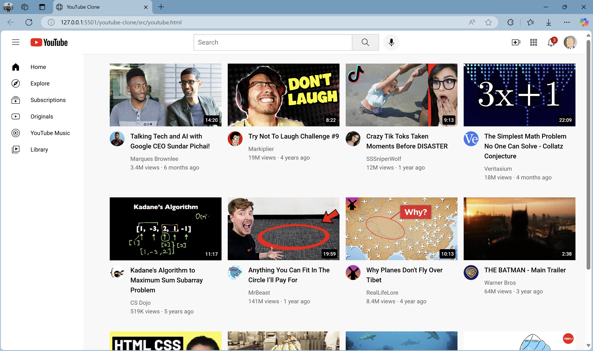
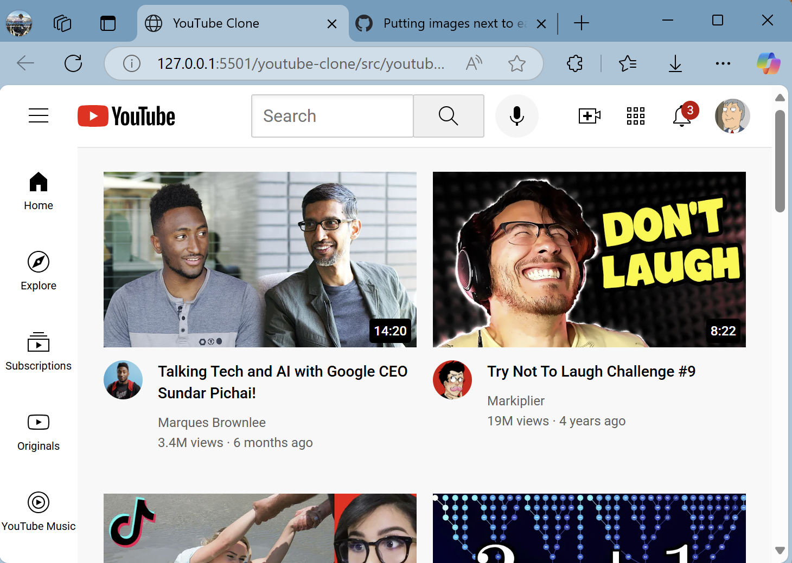
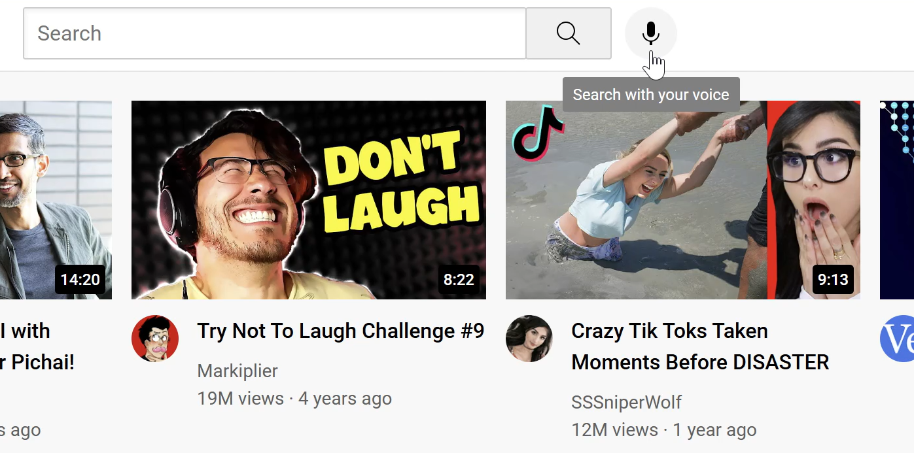
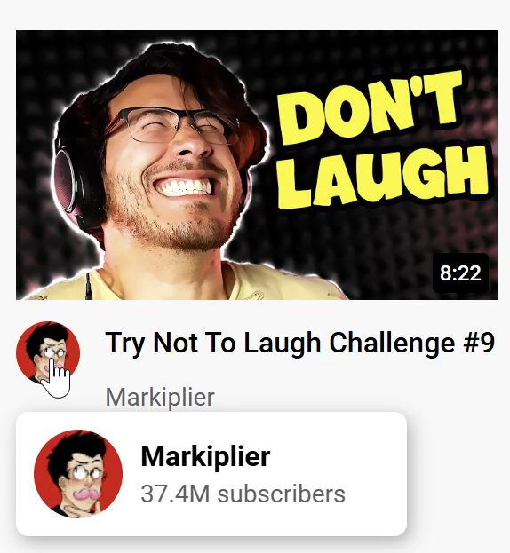

# YouTube Clone in HTML & CSS
*created by Aditya Kumar Bhardwaj*

## Overview
This repository contains the source code for a clone of the **YouTube Homepage** built using **HTML** and **CSS** as part of the HTML & CSS course by SuperSimpleDev. The goal of this project was to learn **Web Development** with semantic HTML and styling layouts using modern CSS techniques. 

This repository also contains documentation of the various lessons covered throughout the course. You will find 15 folders in this repository corresponding to 15 lessons of this course. Each folder has 2 subfolders: **Learning** and **Exercises**.

- The **Learning** folder contains notes, in the form of code snippets and examples, taken during the lesson to serve as a reference for understanding key concepts of HTML/CSS. 
- The **Exercises** folder contains my solutions to the practice questions provided in each lesson.

Note: Lessons 16 and 17 of the course focused entirely on finishing the final YouTube Clone project. Hence, there are no separate folders for these lessons; their content is reflected in the main project codebase for the YouTube clone itself.

### Repository Structure
```
    youtube-clone\
                    |
                    |- course-materials\
                    |   |- Lesson 1 - HTML Basics\   
                    |       |- Exercises\
                    |       |- Learning\
                    |   |- Lesson 2 - CSS Basics\ 
                    |   |- Lesson 3 - Hover, Transitions, Shadows\ 
                    |   |- Lesson 4 - ChromeDev Tools & CSS Box Model\ 
                    |   |- Lesson 5 - Text Styles\ 
                    |               .
                    |               .
                    |               .
                    |   |- Lesson 15 - Position Absolute and Relative\ 
                    |
                    |- readme-images\
                    |
                    |- src\
                    |   |- channel-pictures\
                    |   |- icons\
                    |   |- styles\
                    |   |- thumbnails\
                    |   |- youtube.html
                    |
                    |- README.md    
                    |           
```


## Key Features
- **Responsive Design:** The layout of the webpage can adapt seamlessly to various screen sizes. Font sizes, thumbnails, icons, and the sidebar layout adjust dynamically for an optimal viewing experience as shown in the images below.

<figure>
    
    <figcaption><strong>Responsive Layout – Full Width View</strong></figcaption>
</figure>

  <figure>
    
    <figcaption><strong>Responsive Layout – Narrow Width View</strong></figcaption>
  </figure>

- **Tooltips:** Upon hovering, header buttons and channel logos display tooltips that provide additional information and enhance user interactivity (shown below).

<div style="display: flex; flex-direction: column;">
  <figure>
    
    <figcaption><strong>Tooltip – Header Icon</strong></figcaption>
  </figure>

  <figure>
    
    <figcaption><strong>Tooltip - Channel Logo</strong></figcaption>
  </figure>
</div>

- **Header Navigation Bar:** Includes a YouTube-style logo, responsive search bar, and user action icons like search, voice search, create, and notifications, closely resembling the real YouTube interface.

- **Sidebar:** Displays navigation links such as Home, Explore, Subscriptions, etc. Its layout can also adapt depending on screen wdith, collapsing in narrower views and expanding in larger views. 

- **Video Previews:** Videos are presented with styled thumbnails, titles, and channel info. Each video card is fully interactive - clicking on the thumbnail or video title opens the actual YouTube video in a new tab whereas clicking on the channel logo takes you to the actual channel's page.

## Features of HTML/CSS Used
- **CSS Grid:** For creating and structuring the main content area, allowing for a clean, responsive grid of video previews.

- **Flexbox:** Used in the header and sidebar for flexible and efficient alignment of elements and in positioning and spacing elements within tooltips.

- **CSS Position:** Utilized `absolute`, `relative`, and `fixed` positioning, along with `z-index` to control layering and placement, ensuring that tooltips appear correctly, and that the header remains fixed and visible while scrolling.

- **Nested Layouts:** Nested `<div>` elements are used throughout the project especially in video preview cards, header, and sidebar to group and align elements within one another for better control and styling.

- **Hovers, Transitions, and Shadows:** For styling tooltips and search bar to enhance their interactivity and visual feedback.

- **Text Styles:** Using custom web fonts via Google Fonts and incorporating varying font sizes and font weights to closely match YouTube's aesthetic. 

- **CSS Display Property:** Using values like `display: block`, `display: inline-block`, and `inline` to manage the alignment of elements across different sections of the page.

## Running the Application
1. Clone the repository
    ``` bash
    git clone https://github.com/Leman-24-horas/youtube-clone.git
    ```
2. Head over to the `src` folder in file explorer and open the `youtube.html` file in your browser.

## Future Improvements 
- Add more navigation links to the sidebar such as `Shorts`, `History`, `Playlists`, and a list of subscribed channels. Additionally, make the sidebar vertically scrollable to accommodate longer menus while maintaining a fixed height.

- Create a dropdown-style popup that appears when hovering over the user profile icon. This popup will include options like `Switch Account`, `Sign Out`, `Settings`, `Appearance`, and more.

- Add a horizontal filter bar at the top of the video section to filter videos by categories like **All**, **Music**, **Gaming**, **News**, etc.


## Demo
// link to video
